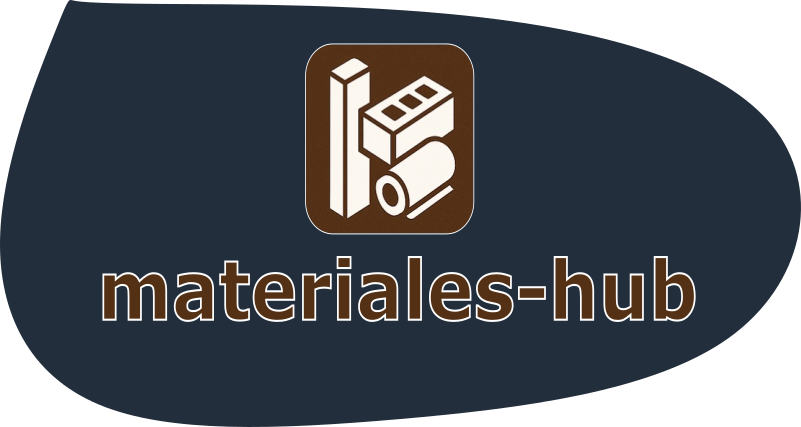

[](https://github.com/mjnizac/materials-hub/actions)
[](https://github.com/mjnizac/materials-hub/actions)
[](https://sonarcloud.io/dashboard?id=MaterialHub-Organization_materials-hub)
[](https://sonarcloud.io/dashboard?id=MaterialHub-Organization_materials-hub)
[](https://www.python.org/)
##
<p align = "center">
  
</p>

**Repositorio de datasets de materiales científicos** - Plataforma web para almacenar, compartir y gestionar datasets de propiedades de materiales siguiendo principios de Open Science.

Desarrollado por **DiversoLab** en la Universidad de Sevilla.

---

## ✨ Características

- 📊 **Gestión de Datasets de Materiales**: Almacena datasets con propiedades de materiales (CSV)
- 🕐 **Versionado de Datasets**: Sistema automático de versiones con comparación y seguimiento de cambios
- 🔍 **Sistema de Recomendaciones**: Descubre datasets relacionados basados en tags, autores y propiedades
- 👥 **Gestión de Usuarios**: Sistema de autenticación y perfiles de usuario
- 🌐 **Integración Zenodo**: Publicación de datasets con DOI

---

## 🔧 Requisitos

- **Python 3.12+**
- **PostgreSQL 14+**

---

## 🚀 Instalación Rápida

### 1. Clonar y Configurar

```bash
git clone https://github.com/MaterialHub-Organization/materials-hub.git
cd materials-hub
python -m venv venv
source venv/bin/activate  # En Windows: venv\Scripts\activate
pip install -r requirements.txt
```

### 2. Configurar Base de Datos

```bash
# Conectar a PostgreSQL
psql -U postgres

# Crear usuario y base de datos
CREATE USER materialhub_user WITH PASSWORD 'tu-password';
CREATE DATABASE materialhub ENCODING 'UTF8';
GRANT ALL PRIVILEGES ON DATABASE materialhub TO materialhub_user;

# En PostgreSQL 15+
\c materialhub
GRANT ALL ON SCHEMA public TO materialhub_user;
\q
```

### 3. Configurar Variables de Entorno

Crea un archivo `.env`:

```bash
FLASK_APP_NAME=MaterialsHub
FLASK_ENV=development
SECRET_KEY=tu-clave-secreta-aqui

POSTGRES_HOSTNAME=localhost
POSTGRES_PORT=5432
POSTGRES_USER=materialhub_user
POSTGRES_PASSWORD=tu-password
POSTGRES_DATABASE=materialhub
```

### 4. Inicializar

```bash
# Setup completo (migraciones + datos de prueba)
rosemary db:setup

# Ejecutar aplicación
flask run
```

La aplicación estará disponible en: **http://localhost:5000**

**Usuario de prueba:** user@example.com / 1234

---

## 📊 Formato de Datasets (CSV)

### Columnas Requeridas

- `material_name` - Nombre del material
- `property_name` - Nombre de la propiedad medida
- `property_value` - Valor de la propiedad

### Columnas Opcionales

- `chemical_formula` - Fórmula química
- `structure_type` - Tipo de estructura cristalina
- `composition_method` - Método de composición
- `property_unit` - Unidad de medida
- `temperature` - Temperatura en Kelvin (Float)
- `pressure` - Presión en Pascales (Float)
- `data_source` - Fuente de datos (EXPERIMENTAL, COMPUTATIONAL, LITERATURE, DATABASE, OTHER)
- `uncertainty` - Incertidumbre/Error de medición (Float)
- `description` - Descripción adicional

### Ejemplo de CSV

```csv
material_name,chemical_formula,property_name,property_value,property_unit,temperature,pressure,data_source
Al2O3,Al2O3,density,3.95,g/cm3,298,101325,EXPERIMENTAL
SiO2,SiO2,hardness,7,Mohs,,101325,LITERATURE
TiO2,TiO2,refractive_index,2.61,,298,,COMPUTATIONAL
```

---

## 🎮 Comandos Principales

### Base de Datos

```bash
rosemary db:setup              # Setup completo (migraciones + datos de prueba)
rosemary db:status             # Ver estado de la base de datos
rosemary db:migrate "mensaje"  # Crear nueva migración
rosemary db:upgrade            # Aplicar migraciones pendientes
```

### Testing

```bash
pytest -v                      # Todos los tests
pytest -m unit -v              # Solo tests unitarios
pytest --cov=app               # Tests con cobertura
```

### Calidad de Código

```bash
rosemary linter                # Ejecutar linter (flake8)
rosemary linter:fix            # Auto-formatear (black + isort)
```

---

## 📁 Estructura del Proyecto

```
materials-hub/
├── app/                      # Aplicación Flask
│   ├── modules/              # Módulos (auth, dataset, profile)
│   └── static/               # CSS, JS, imágenes
├── core/                     # Funcionalidad core
├── migrations/               # Migraciones de base de datos
├── rosemary/                 # CLI de Rosemary
├── .env                      # Variables de entorno
└── requirements.txt          # Dependencias Python
```

---

## 🤝 Contribuir

1. Crea una rama: `git checkout -b feature/mi-feature`
2. Haz tus cambios y commits: `git commit -m "feat: descripción"`
3. Ejecuta los tests: `pytest -v`
4. Ejecuta el linter: `rosemary linter:fix`
5. Push: `git push origin feature/mi-feature`
6. Crea un Pull Request

### Estándares

- **Python**: PEP 8 (flake8)
- **Formato**: Black (120 caracteres por línea)
- **Commits**: [Conventional Commits](https://www.conventionalcommits.org/)

---

## 👥 Equipo

Desarrollado por **DiversoLab** - Universidad de Sevilla

- **Repositorio:** [GitHub](https://github.com/MaterialHub-Organization/materials-hub)
- **Issues:** [GitHub Issues](https://github.com/MaterialHub-Organization/materials-hub/issues)

---

## 📝 Licencia

Este proyecto es parte de una iniciativa académica de la Universidad de Sevilla - DiversoLab.
