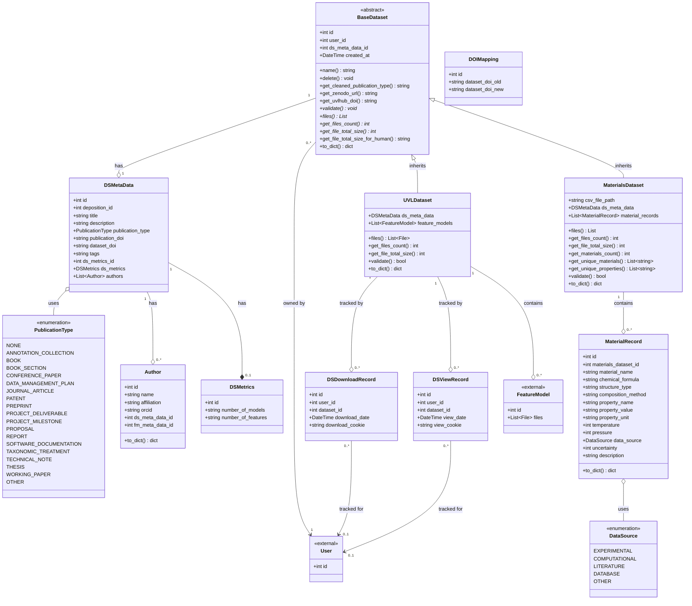

# Diagrama UML - Modelos de Dataset

## Diagrama en Mermaid



## Descripción de las Clases

### **Enumeraciones**

#### PublicationType
Tipos de publicación soportados por el sistema (19 tipos diferentes).

#### DataSource
Origen de los datos de materiales:
- EXPERIMENTAL: Datos obtenidos experimentalmente
- COMPUTATIONAL: Datos de simulaciones computacionales
- LITERATURE: Datos extraídos de literatura científica
- DATABASE: Datos de bases de datos externas
- OTHER: Otros orígenes

---

### **Clases de Metadatos**

#### Author
Representa un autor de un dataset.
- Puede estar asociado a DSMetaData (datasets) o FMMetaData (feature models)
- Contiene información ORCID y afiliación

#### DSMetrics
Métricas estadísticas del dataset.
- Número de modelos
- Número de features

#### DSMetaData
Metadatos descriptivos del dataset.
- Título, descripción, tags
- DOIs de publicación y dataset
- Tipo de publicación
- Relación 1:1 con DSMetrics
- Relación 1:N con Authors

---

### **Clase Base Abstracta**

#### BaseDataset
Clase abstracta que define la estructura común para todos los tipos de datasets.

**Campos comunes:**
- id, user_id, ds_meta_data_id, created_at

**Métodos comunes implementados:**
- `name()`: Retorna el título del dataset
- `delete()`: Elimina el dataset
- `get_cleaned_publication_type()`: Formatea el tipo de publicación
- `get_zenodo_url()`: URL de Zenodo
- `get_uvlhub_doi()`: DOI de UVLHub
- `to_dict()`: Serialización base a diccionario

**Métodos abstractos (deben implementarse en subclases):**
- `validate()`: Validación específica del tipo de dataset
- `files()`: Obtener archivos del dataset
- `get_files_count()`: Contar archivos
- `get_file_total_size()`: Calcular tamaño total

---

### **Clases Derivadas**

#### UVLDataset (tabla: data_set)
Implementación para datasets UVL (Universal Variability Language).

**Relaciones:**
- 1:N con FeatureModel (modelos de características)
- 1:1 con DSMetaData

**Métodos específicos:**
- `files()`: Retorna archivos UVL de todos los feature models
- `get_files_count()`: Suma archivos de todos los feature models
- `get_file_total_size()`: Calcula tamaño total de archivos UVL
- `validate()`: Verifica que existan feature models y metadatos

**Alias:** `DataSet = UVLDataset` (compatibilidad con código legacy)

#### MaterialsDataset (tabla: materials_dataset)
Implementación para datasets de materiales (datos CSV).

**Campos específicos:**
- `csv_file_path`: Ruta al archivo CSV original

**Relaciones:**
- 1:N con MaterialRecord (registros de materiales)
- 1:1 con DSMetaData

**Métodos específicos:**
- `get_materials_count()`: Cuenta total de registros
- `get_unique_materials()`: Lista de materiales únicos
- `get_unique_properties()`: Lista de propiedades únicas
- `validate()`: Verifica CSV y registros válidos
- `to_dict()`: Serialización con datos de materiales

---

### **Modelo de Registro de Material**

#### MaterialRecord (tabla: material_record)
Representa una fila individual en el CSV de materiales.

**Campos obligatorios:**
- `material_name`: Nombre del material
- `property_name`: Nombre de la propiedad
- `property_value`: Valor de la propiedad

**Campos opcionales:**
- `chemical_formula`: Fórmula química
- `structure_type`: Tipo de estructura cristalina
- `composition_method`: Método de composición
- `property_unit`: Unidad de medida
- `temperature`: Temperatura (K)
- `pressure`: Presión (Pa)
- `data_source`: Origen de los datos (enum DataSource)
- `uncertainty`: Incertidumbre
- `description`: Descripción adicional

---

### **Modelos de Seguimiento**

#### DSDownloadRecord
Registra cada descarga de un dataset.
- Cookie UUID para tracking anónimo
- Asociación opcional con usuario autenticado

#### DSViewRecord
Registra cada visualización de un dataset.
- Cookie UUID para tracking anónimo
- Asociación opcional con usuario autenticado

#### DOIMapping
Mapeo entre DOIs antiguos y nuevos para migraciones.

---

## Patrón de Diseño Utilizado

### **Template Method Pattern**

La clase `BaseDataset` implementa el patrón Template Method:

1. **Métodos comunes implementados** en la clase base
   - Operaciones compartidas (delete, get_zenodo_url, to_dict, etc.)

2. **Métodos abstractos** que deben implementar las subclases
   - validate(), files(), get_files_count(), get_file_total_size()

3. **Beneficios:**
   - Código reutilizable entre UVLDataset y MaterialsDataset
   - Comportamiento específico por tipo de dataset
   - Fácil extensión para nuevos tipos de datasets en el futuro

### **Strategy Pattern (implícito)**

Cada tipo de dataset (UVL, Materials) tiene su propia estrategia de:
- Almacenamiento de archivos
- Validación de datos
- Conteo de elementos
- Serialización a diccionario

---

## Jerarquía de Herencia

```
BaseDataset (abstract)
    ├── UVLDataset (concrete)
    │   └── DataSet (alias)
    └── MaterialsDataset (concrete)
```

---

## Relaciones Principales

1. **User → BaseDataset**: Un usuario puede tener múltiples datasets (1:N)
2. **DSMetaData → BaseDataset**: Metadatos compartidos por todos los datasets (1:1)
3. **UVLDataset → FeatureModel**: Dataset UVL contiene feature models (1:N)
4. **MaterialsDataset → MaterialRecord**: Dataset de materiales contiene registros (1:N)
5. **DSMetaData → Author**: Metadatos tienen múltiples autores (1:N)
6. **DSMetaData → DSMetrics**: Metadatos tienen métricas asociadas (1:1)

---

## Notas de Implementación

### Cascadas de Eliminación

Todas las relaciones principales usan `cascade="all, delete"`:
- Al eliminar un Dataset, se eliminan sus FeatureModels/MaterialRecords
- Al eliminar DSMetaData, se eliminan Authors y DSMetrics asociados
- Garantiza integridad referencial automática

### Índices y Rendimiento

**Campos indexados (recomendados):**
- `BaseDataset.user_id` (foreign key)
- `MaterialRecord.materials_dataset_id` (foreign key)
- `MaterialRecord.material_name` (búsquedas frecuentes)
- `MaterialRecord.property_name` (búsquedas frecuentes)
- `DSMetaData.dataset_doi` (búsquedas por DOI)

### Compatibilidad Retroactiva

- `DataSet = UVLDataset`: Alias para mantener compatibilidad con código existente
- Tabla `data_set` mantiene su nombre original para no romper migraciones existentes
